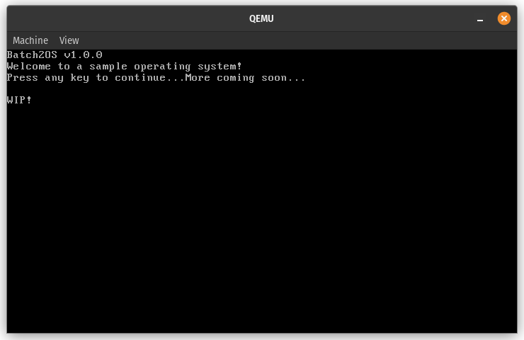

# Batch2OS
A Batch to native 16-bit x86 compiler, made in Rust.

# Usage
``Batch2OS <input> <output> <baseAddress> <loadAddress>``

## Example
``Batch2OS os.bat kernel.bin 0x7C00 0x1000``

# Try it out!
After you've compiled your batch script as a bootable image file, you may want to try it on bare metal now. If that isn't possible, you can try it out in a VM. Here's an example with QEMU:

``qemu-system-i386 kernel.bin``

# Compatibility
Batch2OS emits x86 code that is theoretically compatible starting from the Intel 8086. That is because Batch2OS currently uses real mode BIOS interrupts, which are 16-bit and were introduced back in the 8086. 

# Supported commands
- ``help``
- ``cls``
- ``echo``
- ``pause``
- ``ver``
- ``color``
- ``goto``

# Limitations
- Uses BIOS interrupts to do pretty much everything
- It's limited to loading up to 255 sectors because of the byte limit

# TODO
- Go into protected mode (and figure out how to replace the BIOS interrupts with equivalent code??)
